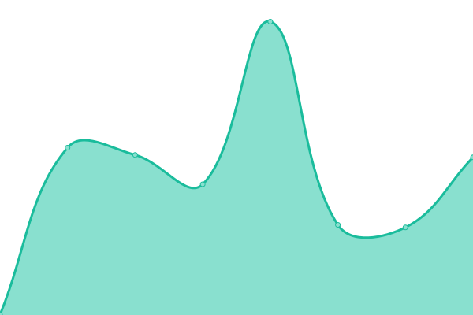

# [📈 Live Status](https://reregaga.github.io/lor-upptime): <!--live status--> **🟧 Partial outage**

This repository contains the open-source uptime monitor and status page for [reregaga](https://reregaga.github.io/lor-upptime), powered by [Upptime](https://github.com/upptime/upptime).

With [Upptime](https://upptime.js.org), you can get your own unlimited and free uptime monitor and status page, powered entirely by a GitHub repository. We use [Issues](https://github.com/reregaga/lor-upptime/issues) as incident reports, [Actions](https://github.com/reregaga/lor-upptime/actions) as uptime monitors, and [Pages](https://reregaga.github.io/lor-upptime) for the status page.

<!--start: status pages-->
<!-- This summary is generated by Upptime (https://github.com/upptime/upptime) -->
<!-- Do not edit this manually, your changes will be overwritten -->
<!-- prettier-ignore -->
| URL | Status | History | Response Time | Uptime |
| --- | ------ | ------- | ------------- | ------ |
|  [LINUX.ORG.RU](https://www.linux.org.ru/) | 🟩 Up | [linux-org-ru.yml](https://github.com/reregaga/lor-upptime/commits/HEAD/history/linux-org-ru.yml) | 

 788ms
     
 | 

<a href="https://reregaga.github.io/lor-upptime/history/linux-org-ru">100.00%</a>
    

|  [LinuxTalks.co](https://linuxtalks.co/) | 🟩 Up | [linux-talks-co.yml](https://github.com/reregaga/lor-upptime/commits/HEAD/history/linux-talks-co.yml) | 

 660ms
     
 | 

<a href="https://reregaga.github.io/lor-upptime/history/linux-talks-co">96.40%</a>
    

|  [Skypack.dev Search](https://www.skypack.dev/search?q=react) | 🟥 Down | [skypack-dev-search.yml](https://github.com/reregaga/lor-upptime/commits/HEAD/history/skypack-dev-search.yml) | 

 1076ms
     
 | 

<a href="https://reregaga.github.io/lor-upptime/history/skypack-dev-search">0.00%</a>
    

<!--end: status pages-->

[**Visit our status website →**](https://reregaga.github.io/lor-upptime)

## 📄 License

- Powered by: [Upptime](https://github.com/upptime/upptime)
- Code: [MIT](./LICENSE) © [reregaga](https://reregaga.github.io/lor-upptime)
- Data in the `./history` directory: [Open Database License](https://opendatacommons.org/licenses/odbl/1-0/)
